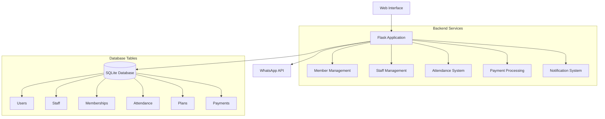
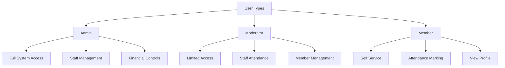
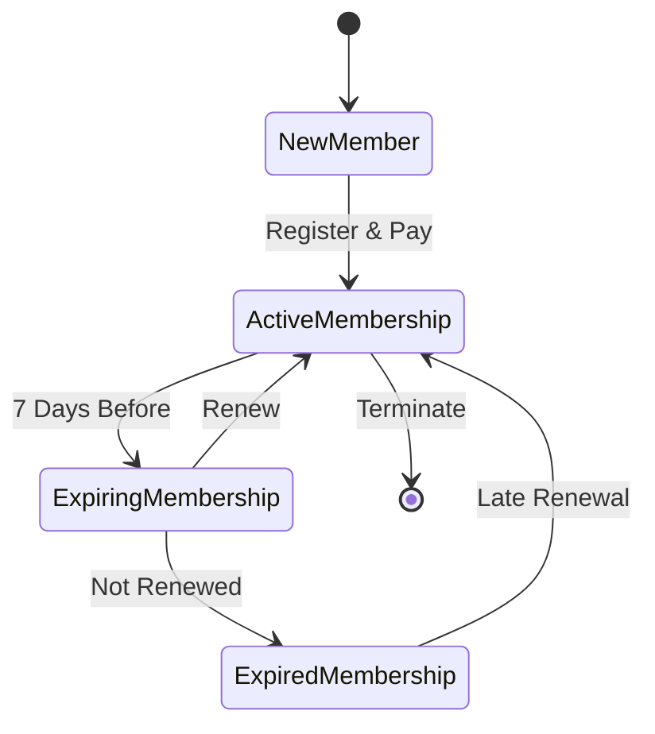
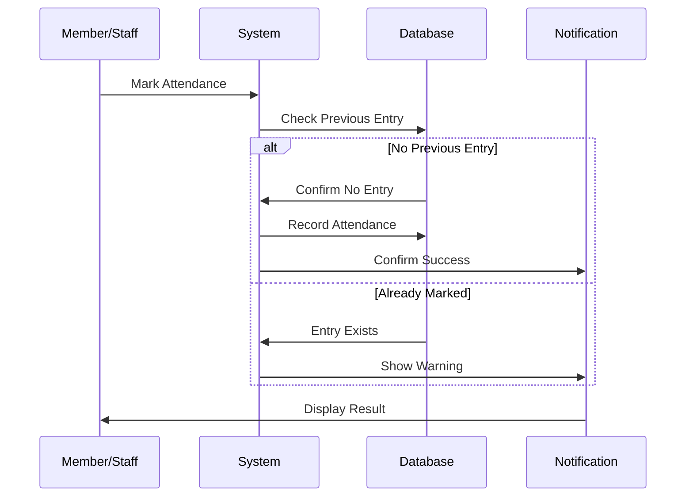
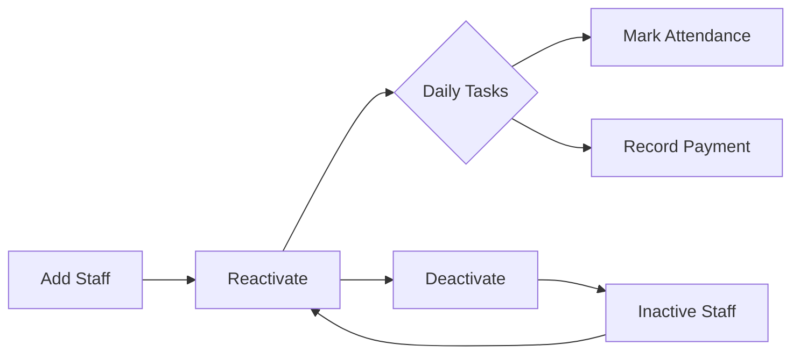
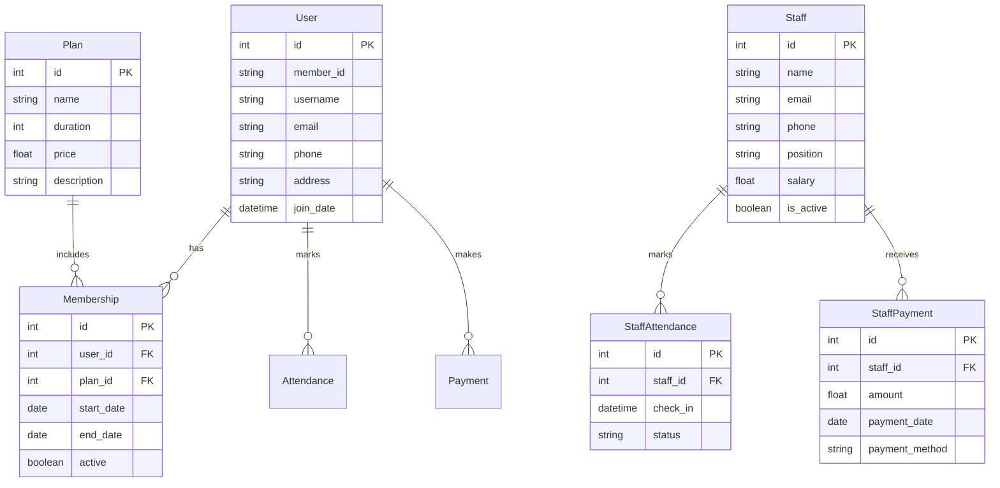

# Gym Management System

A comprehensive gym management system built with Flask for managing members, staff, memberships, attendance, and payments.

## System Architecture



## User Roles and Access Flow



## Membership Management Flow



## Attendance Tracking System



## Staff Management Flow



## Installation

1. Clone the repository:
```bash
git clone https://github.com/yourusername/gym-management.git
cd gym-management
```

2. Create a virtual environment:
```bash
python -m venv venv
source venv/bin/activate  # On Windows: venv\Scripts\activate
```

3. Install dependencies:
```bash
uv add -r requirements.txt
```

4. Initialize the database:
```bash
flask db upgrade
```

5. Create an admin moderator:
```bash
python create_moderator.py
```

6. Run the application:
```bash
flask run
```

## Features

### Member Management
- Add/Edit/View members
- Generate unique member IDs
- Track membership status
- Handle membership renewals
- View attendance history

### Staff Management
- Add/Edit/View staff
- Track staff attendance
- Manage staff payments
- Staff activity status control

### Membership Plans
- Create/Edit membership plans
- Set duration and pricing
- Track active/expired memberships

### Attendance System
- Mark member attendance
- Mark staff attendance
- View attendance reports
- Track check-in times

### Payment Processing
- Record membership payments
- Process staff salaries
- Track payment history
- Multiple payment methods

### Notification System
- WhatsApp integration
- Membership expiry reminders
- Announcements to members
- Customizable messages

### Access Control
- Role-based access control
- Admin and moderator roles
- Secure authentication
- Activity logging

## Database Schema



## API Endpoints

### Member Routes
- `GET /members` - List all members
- `POST /members/add` - Add new member
- `GET /members/<id>` - View member details
- `POST /members/<id>/renew` - Renew membership

### Staff Routes
- `GET /staff` - List all staff
- `POST /staff/add` - Add new staff
- `GET /staff/<id>` - View staff details
- `POST /staff/attendance` - Mark staff attendance

### Plan Routes
- `GET /plans` - List all plans
- `POST /plans/add` - Add new plan
- `DELETE /plans/<id>` - Delete plan

### Attendance Routes
- `POST /attendance/mark` - Mark attendance
- `GET /attendance/today` - View today's attendance

### Payment Routes
- `POST /payments/record` - Record payment
- `GET /payments/history` - View payment history

## Security Considerations

1. Authentication
- Secure password hashing
- Session management
- Role-based access control

2. Data Protection
- Input validation
- SQL injection prevention
- XSS protection

3. API Security
- Rate limiting
- Request validation
- Error handling

## Contributing

1. Fork the repository
2. Create your feature branch
3. Commit your changes
4. Push to the branch
5. Create a pull request

## License

This project is licensed under the MIT License - see the LICENSE file for details.