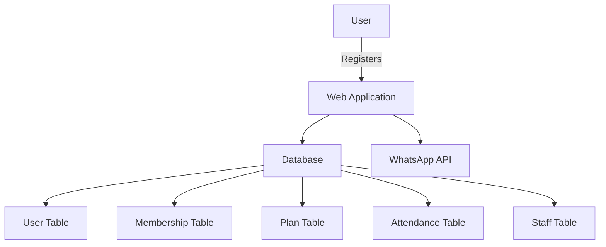
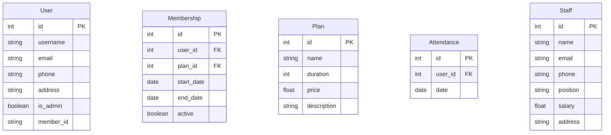
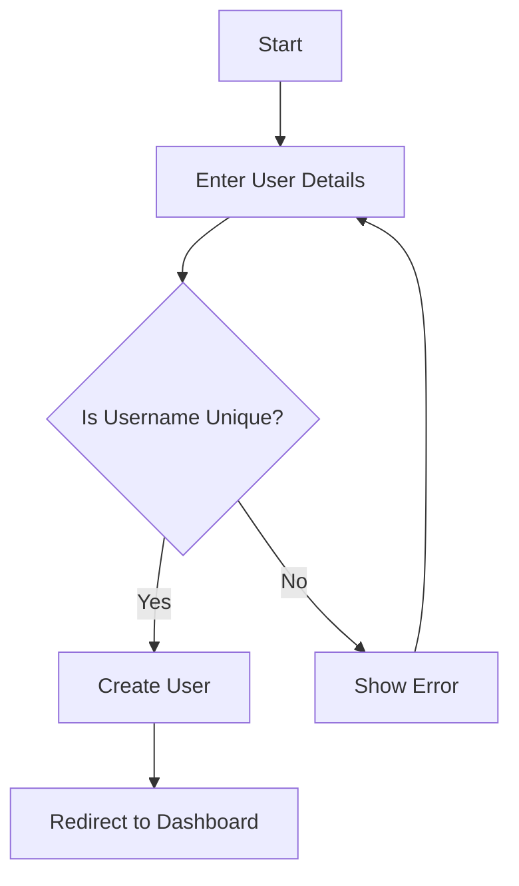
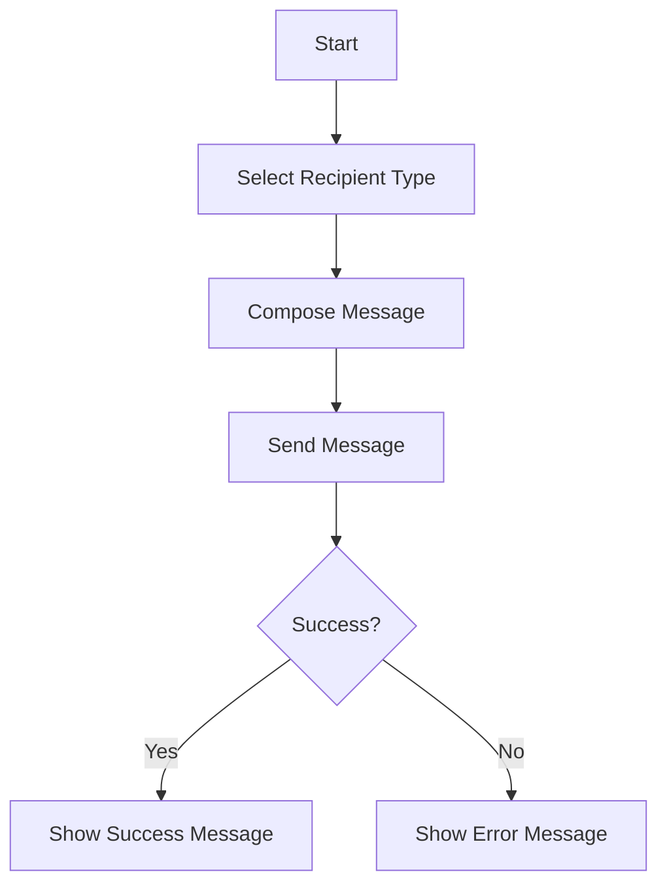

# Gym Management System

## Overview
The Gym Management System is designed to help gym administrators manage members, track attendance, and handle payments efficiently. It includes features for sending announcements via WhatsApp and managing staff.

## Features
- User registration and login
- Membership management
- Attendance tracking
- Payment recording
- WhatsApp announcements
- Membership expiry reminders

## Architecture Diagram


## Database Schema


## Flow Diagrams
### User Registration Flow


### Sending WhatsApp Announcements


## Usage Instructions
1. Clone the repository:
   ```bash
   git clone https://github.com/yourusername/gym-management-system.git
   cd gym-management-system
   ```

2. Install dependencies:
   ```bash
   pip install -r requirements.txt
   ```

3. Set up environment variables in a `.env` file:
   ```
   WHATSAPP_TOKEN=your_whatsapp_token_here
   PHONE_NUMBER_ID=your_phone_number_id_here
   ```

4. Run the application:
   ```bash
   python app.py
   ```

5. Access the application at `http://localhost:5000`.

## Conclusion
The Gym Management System provides a comprehensive solution for managing gym operations efficiently. With features like WhatsApp notifications and membership tracking, it enhances the user experience for both administrators and members.